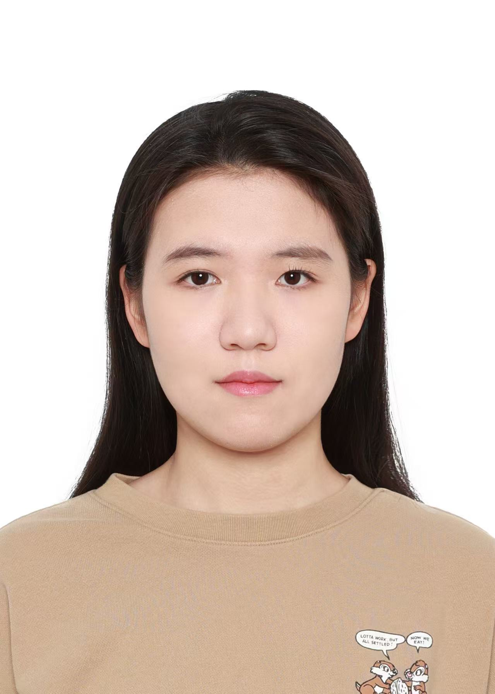

{width=220px}

Hi, my name is Yingzhu Pan. I was born and raised in China, and I majored in Statistics and Economics during my undergraduate studies at the University of Toronto. Outside of academics, I enjoy swimming, taking walks, and exploring new places. \
Through the MDS program, I hope to strengthen my data analysis and programming skills, gain more hands-on experience, and learn how to apply what I have learned to solve real-world problems.

