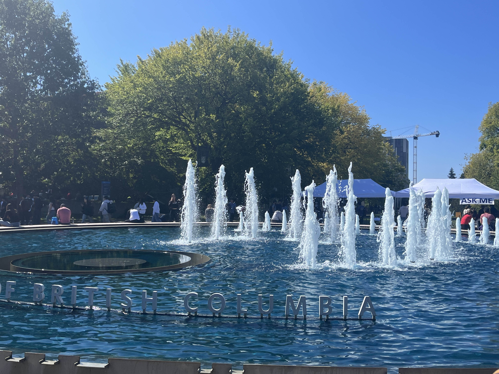

My first few weeks in the MDS program have been exciting and also a little stressful. During orientation, I was really happy to meet many new classmates and learn more about the program. We also learned about the graduation requirements and the course structure. After hearing about all the courses and requirements, I realized that the program would be very intensive, which made me feel a little nervous about the coming months.

During our first week of classes, most other programs at UBC had not started yet, so there were not many people on campus. However, we quickly became busy with our courses. We have four labs and several worksheets every week, so there is always something to work on. Even though every day is busy, I also feel that my time is very fulfilling.

So far, I have learned a lot of practical knowledge and useful skills in a very short time. The workload is heavier and the pace is faster than I expected, but I am gradually getting used to it. I hope that I can continue learning new things, improve my data science skills, and enjoy the rest of my time in the MDS program.